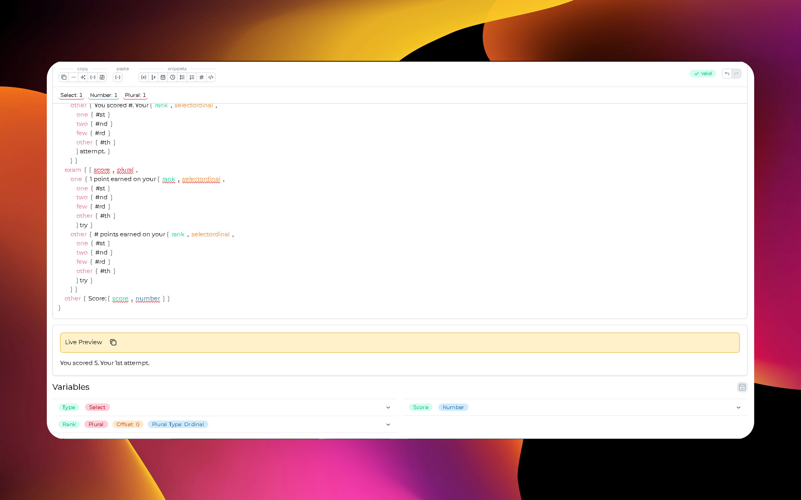

<h2 style="text-align: center; text-decoration:bold; font-size: 25px;">🚀Fast and lightweight IDE for ICU messages</h2>

ICU Studio is a blazing-fast desktop IDE designed to simplify working with ICU MessageFormat. Say goodbye to manual JSON editing and syntax errors—manage your plural, select, date, and number messages with an intuitive interface, real-time preview, and smart validation.

    

 
 

- ✍️ Write complex ICU messages with **one-click snippets**
- 👁️ Preview translations **in real-time**
- 📋 Copy outputs in **5 different formats** (JSON, raw, next-intl, etc.)
- ✅ Catch syntax errors instantly with **smart validation**
- ↩️ Undo/Redo your changes with zero friction

## 🤝 Contributing

We welcome contributions from the community! Whether it's fixing a bug, adding a new feature, or improving documentation, every bit helps.

### Need help?

Open an issue or start a discussion—we're here to help! 💬
